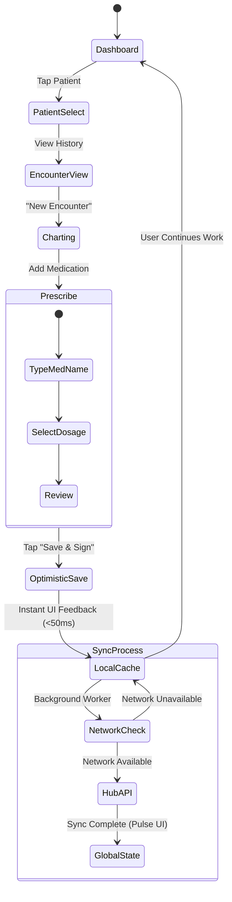
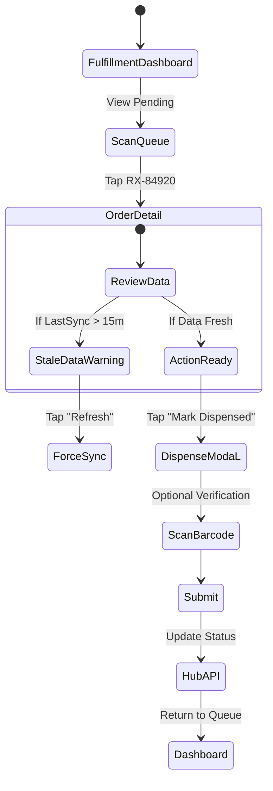

# UX Design Specification Ultranos

**Author:** CEO
**Date:** 2026-04-27

---

<!-- UX design content will be appended sequentially through collaborative workflow steps -->

## Core User Experience

### Defining Experience
The core experience of Ultranos revolves around uninterrupted healthcare workflows. Whether a GP is charting a patient encounter or a lab is logging test results, the action must feel fluid and instantaneous, entirely decoupled from the actual network state. The system handles the complexity of syncing data in the background, allowing the user to focus solely on clinical or fulfillment tasks. Crucially, while secondary data utilizes progressive disclosure, the primary action of any screen (e.g., charting, dispensing) remains immediately accessible without hidden gestures.

### Platform Strategy
- **Mobile-First / Cross-Platform:** Designed primarily for iOS and Android tablets and smartphones, acknowledging the on-the-go nature of remote healthcare workers.
- **Offline-First Architecture:** Local-first data caching is not a fallback—it is the primary mode of interaction, ensuring zero-latency UI responses. **The architecture must guarantee local data persistence even if the application is immediately backgrounded or closed.**
- **Touch-Optimized:** Extensive use of gestures (swipes for quick actions, bottom sheets for deep dives) to maximize screen real estate for dense clinical data.

### Effortless Interactions
- **Network Transitions:** Moving from offline to online (and vice versa) happens silently without interrupting the user.
- **Instant Local Feedback:** **While we eliminate network loading spinners, every user action must provide immediate local visual feedback (e.g., state changes, haptics) to confirm the interaction was registered.**
- **Background Synchronization & Conflict Surfacing:** Data payloads resolve automatically. While successful syncs are silent, data conflicts (e.g., concurrent offline edits) are explicitly and immediately surfaced for user resolution.
- **Context Switching:** Moving between a patient's summary and their detailed lab history requires a single, natural gesture.

### Critical Success Moments
- **The "It Just Works" Offline Moment:** A GP submits an urgent prescription while in a dead zone, and the app instantly confirms it's saved and queued.
- **The Reconnection Pulse:** When connectivity is restored, the app provides a subtle, satisfying tactile/visual pulse confirming that all queued data has successfully synchronized with the Hub API.
- **Zero-Latency Search:** A pharmacy instantly pulls up a patient's prescription history from the local cache without seeing a loading spinner.

### Experience Principles
- **Abstract the Network:** Clinical workflows must never be blocked by loading screens waiting for server responses.
- **Trust through Transparency:** While sync is automatic, users must have absolute certainty about the freshness of their data. The UI will employ unmistakable, high-visibility banners when a user is viewing potentially stale data in critical clinical or fulfillment contexts.
- **Dense but Digestible:** Use progressive disclosure to keep mobile screens clean while making dense medical data accessible.
- **Context is King (Accessible Theming):** The UI must visually reinforce whether the user is in a clinical, fulfillment, or consumer context. **This must be achieved through accessible, multi-sensory theming (distinct structural layouts, typography, and iconography) rather than relying solely on color palettes.**

## Desired Emotional Response

### Primary Emotional Goals
- **For Clinicians (GPs):** Calm, Confident, and Empowered. The UI should fade into the background, feeling like an invisible, reliable assistant rather than an administrative hurdle.
- **For Fulfillment (Labs/Pharmacies):** Efficient and Focused. The design must promote speed and accuracy, minimizing cognitive load.
- **For Patients:** Reassured and Connected. The interface should feel welcoming, transparent, and safe, reducing the anxiety often associated with healthcare.

### Emotional Journey Mapping
- **Onboarding:** Relief — "Finally, a medical app that feels modern and doesn't require a manual."
- **During Core Action (e.g., Charting):** Flow — The user loses track of the UI because the interactions are entirely natural and frictionless.
- **During Network Transitions:** Trust — Reassuring tactile pulses confirm data safety, replacing the anxiety of "Did that actually save?"
- **During Conflict Resolution:** Supported — Instead of frustration over a sync collision, the user feels guided by a system that safely catches and resolves errors.

### Micro-Emotions
- **Confidence > Anxiety:** Built through explicit local feedback and guaranteed data persistence.
- **Trust > Skepticism:** Achieved by never hiding the true state of the network or data freshness.
- **Accomplishment > Frustration:** Created by celebrating the completion of complex tasks (like finishing a day's clinical notes) with subtle visual rewards.

### Design Implications
- **To Foster Trust:** Employ deterministic UI states. Avoid ambiguous iconography; use explicit text labels paired with high-visibility banners for stale data.
- **To Foster Calm:** Utilize generous whitespace, soft thematic palettes (clinical blues, pharmacy greens), and reserve aggressive alert colors (reds, harsh yellows) strictly for clinical safety warnings.
- **To Foster Flow:** Ensure all micro-interactions and state changes resolve in under 200ms to maintain the illusion of instantaneity.

### Emotional Design Principles
- **Do No Harm (To User Patience):** Never make the user wait for something the system can do in the background.
- **Quiet Competence:** The UI should only speak up when it has something important to say (e.g., sync conflicts); otherwise, it stays out of the way.
- **Empathetic Error Handling:** Assume the user is stressed; design error states to be solutions, not scoldings.

## UX Pattern Analysis & Inspiration

### Inspiring Products Analysis

- **Linear (Productivity):** The gold standard for offline-first, zero-latency UX. Every action happens instantly on the local client, and the sync engine handles the rest silently.
- **Uber (Consumer Transport):** Masters of handling complex, real-time state changes (matching, tracking, network drops) while keeping the user calm through reassuring, smooth UI transitions.
- **Notion (Knowledge Management):** Exceptional at progressive disclosure. A screen can start clean and minimalist but expand to reveal incredibly dense, nested data structures without overwhelming the user.

### Transferable UX Patterns

**Navigation Patterns:**
- **Command Palette / Universal Search (Linear):** Allow power users (like GPs) to quickly jump to a specific patient chart or medication by typing, bypassing nested menus entirely.
- **Bottom Sheet Details (Apple Maps/Uber):** Keep the primary list or map in context while pulling up detailed patient or lab order info from the bottom of the screen.

**Interaction Patterns:**
- **Optimistic UI Updates (Linear):** When a doctor prescribes medication, the UI instantly reflects success. The system assumes the background sync will succeed, rather than blocking the user with a spinner.
- **Fluid State Transitions (Uber):** When connectivity drops, instead of throwing an ugly error, the UI elegantly shifts to an "Offline Mode" state with reassuring copy.

**Visual Patterns:**
- **Minimalist Density (Notion):** Use clean typography and generous padding for high-level summaries, utilizing subtle chevrons or expanding cards for deep clinical histories.

### Anti-Patterns to Avoid

- **The Blocking Spinner:** The classic enterprise EHR anti-pattern. Never show a full-screen "Please wait..." spinner during data entry.
- **Ambiguous Technical Errors:** Avoid exposing technical jargon (e.g., "Network Timeout 504"). Instead, use actionable, reassuring copy: "You are offline. Notes saved locally."
- **Hamburger Menu Hell:** Burying primary, high-frequency actions inside deep, nested side-drawers creates unnecessary cognitive load.

### Design Inspiration Strategy

**What to Adopt:**
- **Optimistic UI:** Implement immediate local state changes for all data entry to guarantee zero-latency clinical charting.
- **Universal Search:** Adopt a global search bar/command palette as the primary navigation tool for finding patients or lab results.

**What to Adapt:**
- **Consumer State Tracking:** Adapt consumer app tracking (like Uber's ride status) into a "Prescription Journey" tracker for the Pharmacy and Patient apps.

**What to Avoid:**
- **Modal Overload:** Avoid blocking popups (modals) unless absolutely required for a clinical safety alert. Everything else should be inline or in a non-blocking toast notification.

## Design System Foundation

### 1.1 Design System Choice

**Themeable Cross-Platform System** (driven by strict Design Tokens). We will adopt a robust, established base component library that prioritizes accessibility, but we will strip its default styling in favor of our own context-specific design tokens.

### Rationale for Selection

- **Speed to MVP:** We cannot afford to build accessible healthcare primitives (like date pickers and bottom-sheets) from scratch. An established system gives us robust, tested components instantly.
- **Contextual Theming:** Ultranos requires three distinct contextual themes (Clinical, Fulfillment, Consumer) running on the same underlying architecture. A themeable system driven by design tokens is the only scalable way to achieve this without maintaining three separate codebases.
- **Accessibility:** Healthcare apps must meet strict accessibility guidelines. Relying on an established foundation ensures our core interactive elements are robust out of the box.

### Implementation Approach

- **Token-Driven Architecture:** All colors, typography, spacing, and elevations will be defined as Design Tokens.
- **Semantic Naming:** Tokens will be named semantically (e.g., `color-background-critical-alert`) rather than literally (e.g., `color-red-500`) to allow for seamless visual context switching between the GP, Lab, and Patient applications.
- **Component Primitives:** We will wrap the base system's components in our own Ultranos wrappers to enforce our token usage and prevent ad-hoc styling.

### Customization Strategy

- **Clinical Theme (GP App):** High contrast, cool tones (blues/slates), optimized for dense data readability and reduced eye strain during long shifts.
- **Fulfillment Theme (Lab App):** High energy, clear status colors (greens/ambers), optimized for fast scanning and task completion.
- **Consumer Theme (Patient App):** Soft, welcoming tones (warm purples/teals), optimized for reassurance, large touch targets, and low cognitive load.

## 2. Core User Experience

### 2.1 Defining Experience
The core interaction that defines Ultranos is **Zero-Latency Clinical Data Entry**. It is the moment a GP charts a complex patient encounter in a hospital basement with zero Wi-Fi, hits "Save", and the app instantly confirms the action without a single loading spinner. The defining feeling is absolute trust that their work is safe, regardless of network conditions.

### 2.2 User Mental Model
- **The Current Model (Anxiety):** "If I don't have internet, the EHR will freeze, crash, or show an endless spinner, and I will lose my 15 minutes of charting notes."
- **The Ultranos Model (Trust):** "My device is my immediate source of truth. The cloud is just a background backup process that I don't need to manage."

### 2.3 Success Criteria
- **Zero Latency:** All primary data entry actions (saves, edits) must register locally in under 50ms.
- **Zero Blocking:** No blocking UI elements (spinners, un-dismissible modals) are ever shown while waiting for network requests.
- **Absolute Persistence:** 100% data persistence guarantee even if the app is force-closed immediately after tapping save.

### 2.4 Novel UX Patterns
We are introducing a pattern common in modern productivity apps (like Linear) but novel in healthcare: **Optimistic UI Updates paired with Asynchronous Sync Status.**
Because healthcare workers have been conditioned to distrust offline modes, we cannot be entirely silent. We must teach the user to trust the local save by explicitly differentiating between "Saved Locally" and "Synced to Cloud" states using subtle, non-intrusive indicators.

### 2.5 Experience Mechanics
**1. Initiation:** 
The GP selects a patient and taps "New Encounter" or "Prescribe".

**2. Interaction:** 
The GP inputs clinical data. They tap the primary "Save & Sign" button.

**3. Feedback (Local):** 
The UI responds instantly (<50ms). The button transforms into a "Saved" state (e.g., turns green with a checkmark). Simultaneously, a subtle global status indicator (e.g., a small cloud icon in the header) updates to show "1 pending sync". The user is never blocked from navigating away.

**4. Completion (Network):** 
The user moves to their next task. In the background, when network connectivity is detected, the payload is sent to the Hub API. Upon success, the global status indicator provides a soft, satisfying pulse (visual and haptic) and clears, confirming absolute synchronization.

## Visual Design Foundation

### Color System

### Color System

To support our three personas, we will utilize the Wise-inspired semantic color system. All colors must meet WCAG AA contrast standards.

- **Primary Brand (Global Foundation):**
  - *Near Black (`#0e0f0c`):* Primary text and dense backgrounds.
  - *Wise Green (`#9fe870`):* Primary CTA buttons and brand accents.
  - *Dark Green (`#163300`):* Button text on green.
  - *Light Surface (`#e8ebe6`):* Subtle green-tinted light surface for cards.
- **Contextual Theming Applications:**
  - *Clinical Theme (GP):* High contrast, utilizing Near Black backgrounds for sidebars with White (`#ffffff`) content areas, emphasizing density and focus.
  - *Fulfillment Theme (Lab/Pharmacy):* Action-oriented, utilizing Light Surface (`#e8ebe6`) backgrounds with heavy use of Positive Green (`#054d28`) for task completion tracking.
  - *Consumer Theme (Patient):* Welcoming, utilizing Background Cyan (`rgba(56,200,255,0.10)`) accents and larger Light Surface cards.
- **Semantic Functional Colors:**
  - *Error:* Danger Red (`#d03238`).
  - *Warning/Sync:* Warning Yellow (`#ffd11a`).

### Typography System

Healthcare requires absolute clarity, but our brand requires extreme confidence.
- **Display Typeface:** *Wise Sans* (or equivalent Black/900 weight sans-serif). Used exclusively at weight 900 with an ultra-tight line-height of 0.85 for billboard-scale bold headlines.
- **Body / UI Typeface:** *Inter*. Used at weight 600 (Semibold) as the default reading weight to project confidence.
- **Contextual Alternates:** OpenType `"calt"` is enabled globally on all text.
- **Type Scale Adjustments:** 
  - *Clinical/Fulfillment:* Scales down to 14px (Inter) for data density while maintaining weight 600 for legibility.
  - *Consumer:* Utilizes massive Mega Display (126px) for key metrics and 18px (Inter) for body.

### Spacing & Layout Foundation

We will employ the strict Wise-inspired component styling.
- **Buttons:** Pill shape (`9999px` border-radius). Hover states use physical growth (`transform: scale(1.05)`) rather than color shifts.
- **Cards & Containers:** Large rounded corners (`16px` for small cards, `30px` to `40px` for large data tables).
- **Depth & Elevation:** Minimal shadows. Use exclusively Ring Shadows (`rgba(14,15,12,0.12) 0px 0px 0px 1px`) to maintain a flat, bold aesthetic. No traditional soft drop shadows.

### Accessibility Considerations

- **Contrast Ratios:** All text must meet WCAG AAA (7:1) contrast against its background. The Wise Green (`#9fe870`) paired with Dark Green (`#163300`) meets strict legibility requirements.
- **Motion Accessibility:** The `scale(1.05)` button hover animations must respect `prefers-reduced-motion` OS-level settings.
- **Touch Targets:** Pill buttons ensure generous touch targets, specifically critical for the fast-paced Fulfillment environment.

## Design Direction Decision

### Design Directions Explored
We generated an interactive HTML visualizer to explore three contextual themes (Clinical, Fulfillment, Consumer) applying the core Wise-inspired design tokens. 

### Chosen Direction
**Wise-Inspired Contextual Theming.** We will adopt the bold, opinionated design system outlined in `design.md` across all three app contexts, utilizing heavy typography (Weight 900, 0.85 line-height) and physical hover animations (`scale(1.05)`) over color shifting.

### Design Rationale
The Wise design system perfectly encapsulates the emotional goals of Ultranos. The extreme boldness of the typography projects ultimate confidence, while the Lime Green and Near Black color palette feels fresh, modern, and distinct from legacy corporate EHRs. 

### Implementation Approach
- **Global Tokens:** Ensure `design.md` tokens (Lime Green, Near Black, OpenType `calt`) are loaded at the root level of the application.
- **Component Behaviors:** Implement the `scale(1.05)` hover and `scale(0.95)` active states globally on all buttons and interactive cards.
- **Shadow Elimination:** Replace all standard drop shadows with the specific ring shadow (`rgba(14,15,12,0.12) 0px 0px 0px 1px`).

## User Journey Flows

### Journey 1: GP Offline Encounter & Prescribing
The GP must be able to chart and prescribe seamlessly without worrying about network state. The UI remains fully interactive and relies on the optimistic UI pattern we established earlier.

### Journey 2: Pharmacy Fulfillment
The pharmacist relies on the "Positive Green" action-oriented UI to quickly scan queues, verify prescriptions, and mark them dispensed.

### Journey Patterns

Across these flows, we will standardize the following patterns:

**Decision Patterns:**
- **The "Primary Action" Anchor:** In the Clinical and Fulfillment themes, the primary action (e.g., "Save & Sign" or "Mark Dispensed") is always a Wise Green pill button anchored to the bottom right or spanned across the bottom of the card.
- **Explicit Override:** If data is stale (Warning Yellow banner), the user must explicitly acknowledge the warning before the primary action button becomes active.

**Feedback Patterns:**
- **Optimistic State Changes:** All buttons physically scale (`1.05`) on press, and immediately switch to a success state locally, transferring the actual "waiting" burden to the global sync status indicator in the header.
- **The Reassurance Pulse:** When background sync completes, the global sync indicator pulses green. 

### Flow Optimization Principles
- **Minimize Steps to Value:** Use universal search to jump straight from Dashboard to Patient Charting, skipping intermediate list views.
- **Reduce Cognitive Load:** Leverage the Wise-inspired typography (heavy weight, tight line heights) to clearly distinguish critical lab values or drug dosages from standard notes.

## Component Strategy

### Design System Components
We will leverage a headless or highly-themeable base component library (e.g., Radix UI, Headless UI, or an unstyled React Native equivalent) to provide accessible primitives that work seamlessly across both the **PWA (Desktop/Web)** and **Mobile Apps (iOS/Android)**.

**Available Base Primitives:**
- Form Controls (Inputs, Selects, Checkboxes)
- Layout Primitives (Stacks, Grids)
- Modals, Tooltips, and Popovers (which we will use sparingly)
- Typography wrappers

*Note: All base components will be wrapped to enforce the Wise-inspired styling (e.g., 9999px border-radius on buttons, `scale(1.05)` hover interactions, and OpenType `calt` typography settings).*

### Cross-Platform Component Adaptability
Components must intelligently adapt their behavior based on the deployment target:
- **Mobile Apps:** Ensure touch targets are minimum 44x44pt. Hover states (`scale(1.05)`) translate to immediate press/active states. Focus heavily on gesture-based dismissal (swiping down bottom sheets).
- **PWA Desktop:** Enable rich keyboard navigation. Utilize tooltips (which don't exist on mobile) for dense data clarification. Ensure hover states provide immediate cursor feedback.

### Custom Components

The core experience of Ultranos demands specialized components that bridge the mobile/desktop divide:

#### 1. Optimistic Action Button
**Purpose:** Handles the zero-latency "Save" action, decoupling the UI response from the network response.
**Usage:** Used for all primary data mutations (e.g., Prescribing, Dispensing).
**States:**
- *Default:* Wise Green pill.
- *Hover (PWA) / Press (Mobile):* `scale(1.05)` or `scale(0.95)` respectively.
- *Optimistic Success:* Instantly turns into a checkmark state (<50ms) upon press, regardless of network.
**Interaction Behavior:** Resolves locally instantly. Triggers global sync queue behind the scenes.

#### 2. Global Sync Indicator
**Purpose:** Abstracts the network state while maintaining user trust.
**Usage:** Anchored globally in the header of all apps (Clinical, Fulfillment, Consumer).
**States:**
- *Idle:* Invisible or minimal icon.
- *Queueing:* Shows a subtle numeric badge (e.g., "3 pending").
- *Syncing:* Gentle pulsing animation.
- *Success Pulse:* A brief, satisfying green pulse. On mobile, this is accompanied by haptic feedback. On PWA, it is purely visual.

#### 3. Clinical Command Palette
**Purpose:** Universal search allowing GPs to bypass nested navigation.
**Usage:** 
- **PWA Desktop:** Triggered instantly via keyboard shortcut (`Cmd+K` / `Ctrl+K`).
- **Mobile:** Triggered via a prominent floating action button (FAB) or global search icon.
**Content Guidelines:** Surfaces patients, lab results, and medications in a flat, searchable list. Uses the 900-weight typography for instant scannability.

### Component Implementation Strategy
- **Token Injection:** All components must consume the global `design.md` tokens (Lime Green, Near Black, Ring Shadows). Hardcoding colors or spacing is strictly forbidden.
- **Isomorphic Design:** Components should be designed "isomorphically" where possible—the core logic (like the optimistic UI state machine) is shared across the PWA and Mobile codebases, even if the rendering layers differ slightly.

### Implementation Roadmap

**Phase 1 - The Core Engine:**
- Integrate the headless component library and map all `design.md` tokens.
- Build the **Optimistic Action Button** and the **Global Sync Indicator**. These are required to prove out the zero-latency experience on both web and mobile.

**Phase 2 - Form & Function:**
- Skin all standard form inputs, dropdowns, and cards.
- Implement the **Clinical Command Palette** to establish the primary navigation paradigm (ensuring `Cmd+K` works perfectly on the PWA).

**Phase 3 - Refinement:**
- Implement data visualization components (e.g., graphs for lab results).
- Fine-tune accessibility (ARIA labels, keyboard navigation focus rings using the standard inset shadow).

## UX Consistency Patterns

### Button Hierarchy

**Primary Actions (The "Go" Button):**
- **Visual Design:** Wise Green (`#9fe870`) pill button with Dark Green (`#163300`) text.
- **Usage:** Reserved for the single most important action on a screen (e.g., "Save & Sign", "Mark Dispensed").
- **Behavior:** Transforms to `scale(1.05)` on hover (PWA) or long-press. Compresses to `scale(0.95)` on active click/tap. 

**Secondary Actions:**
- **Visual Design:** Subtle Pill using Dark Green at 8% opacity (`rgba(22, 51, 0, 0.08)`) with Near Black text (`#0e0f0c`).
- **Usage:** For alternative actions (e.g., "Cancel", "View History").
- **Behavior:** Shares the identical scale transform behavior as the Primary button to maintain physical consistency.

### Feedback Patterns

**The Optimistic Success Pattern:**
- **Behavior:** Instead of a blocking spinner, pressing a Primary Action button instantly transitions the button itself into a "Success" state (e.g., text changes to a checkmark) for ~1000ms before returning to its default state or advancing the screen.
- **Global Sync:** The actual network request is handed off to the Global Sync Indicator in the header, which pulses green when the background task completes.

**The Stale Data Warning:**
- **Visual Design:** A high-contrast Warning Yellow (`#ffd11a`) banner placed immediately above the actionable area.
- **Behavior:** If data is potentially out of sync (e.g., a patient's chart hasn't synced in 15 minutes), the banner appears. The user *must* explicitly acknowledge the warning (e.g., tapping "I Understand" or "Force Sync") before the Primary Action button becomes enabled.

### Form Patterns

**Focus and Input States:**
- **Visual Design:** Standard inputs use a 10px border radius. 
- **Focus State:** We strictly avoid colored outer glow rings. Instead, we use the Wise Inset shadow (`rgb(134,134,133) 0px 0px 0px 1px inset`) to indicate focus, maintaining the bold, flat aesthetic.
- **Validation:** Errors are displayed inline beneath the field using Danger Red (`#d03238`) accompanied by a mandatory alert icon. Color alone is never used to indicate an error.

### Navigation Patterns

**The Universal Jump (Command Palette):**
- **Usage:** The primary method for traversing distinct data silos (e.g., jumping from Patient A's chart to Patient B's lab results).
- **Trigger:** `Cmd+K` on desktop, or a prominent persistent search icon on mobile.

**Contextual Deep Dives:**
- **Usage:** When a user needs to see more detail without losing their place (e.g., viewing a drug interaction warning while writing a prescription).
- **Mobile:** Bottom Sheets that slide up over the content, easily dismissible via a downward swipe.
- **PWA Desktop:** Right-side sliding panels that squeeze the main content, allowing side-by-side reference.

## Responsive Design & Accessibility

### Responsive Strategy
Ultranos must adapt fluidly between on-the-go mobile usage and dense desktop clinical charting.

- **Mobile Strategy (Smartphones):** Optimized for single-handed use. Primary actions are anchored to the bottom. Deep dives utilize bottom sheets rather than navigating to entirely new pages to preserve context.
- **Tablet Strategy:** Optimized for two-handed use in clinical settings. Leverages split-pane layouts (e.g., Patient Queue on the left third, active Charting on the right two-thirds).
- **Desktop Strategy (PWA):** Maximizes screen real estate for dense data tables. Replaces touch gestures with robust keyboard navigation (`Cmd+K` for search, arrow keys for table navigation) and utilizes the `scale(1.05)` transform heavily on mouse hover.

### Breakpoint Strategy
We will strictly adhere to the responsive breakpoints defined in the `design.md` foundation:

- **Mobile:** `<576px` (Single column layout)
- **Tablet:** `576px – 992px` (2-column layout transition)
- **Desktop:** `992px – 1440px` (Full layout with side navigation)
- **Large:** `>1440px` (Expanded ultra-dense data view)

### Accessibility Strategy
Given the critical nature of healthcare software, Ultranos targets **WCAG AA compliance globally**, with **WCAG AAA compliance for all typography**.

- **Contrast:** The core brand colors—Wise Green (`#9fe870`) paired with Dark Green text (`#163300`) and Near Black (`#0e0f0c`) on White/Light Surface—exceed AA contrast requirements.
- **Motion:** The signature `scale(1.05)` physical button animations must respect the OS-level `prefers-reduced-motion` media query, disabling the scale effect for users sensitive to motion.
- **Touch Targets:** All interactive elements on mobile breakpoints must have a minimum touch target area of 44x44px, easily achieved via the pill-button paradigm.
- **No Color-Only Meaning:** Error and Warning states (like the Stale Data banner) must always include semantic icons and explicit text, never relying solely on the Danger Red or Warning Yellow colors.

### Testing Strategy
- **Responsive:** Mandatory testing on real iOS and Android devices, particularly focusing on the transition between portrait (Mobile) and landscape (Tablet) orientations.
- **Accessibility:** 
  - Automated testing in the CI pipeline using Axe-core.
  - Manual screen reader testing (VoiceOver on iOS, NVDA on Windows) for the Optimistic UI state changes (ensuring the screen reader announces "Saved" even when the visual change is instant).
  - Keyboard navigation audits to ensure the entire PWA can be operated without a mouse.

### Implementation Guidelines
- **CSS Units:** Use `rem` for all typography to respect the user's OS or browser-level font size preferences. Use relative units (`vh`, `vw`, `%`) for layout structures.
- **Focus Rings:** Implement strict keyboard focus management. When navigating via keyboard, use the Wise inset shadow (`rgb(134,134,133) 0px 0px 0px 1px inset`) rather than the browser default blue outline to maintain brand consistency.
- **ARIA Live Regions:** Use `aria-live="polite"` on the Global Sync Indicator so screen readers announce when background syncing is complete without interrupting the user's current task.
